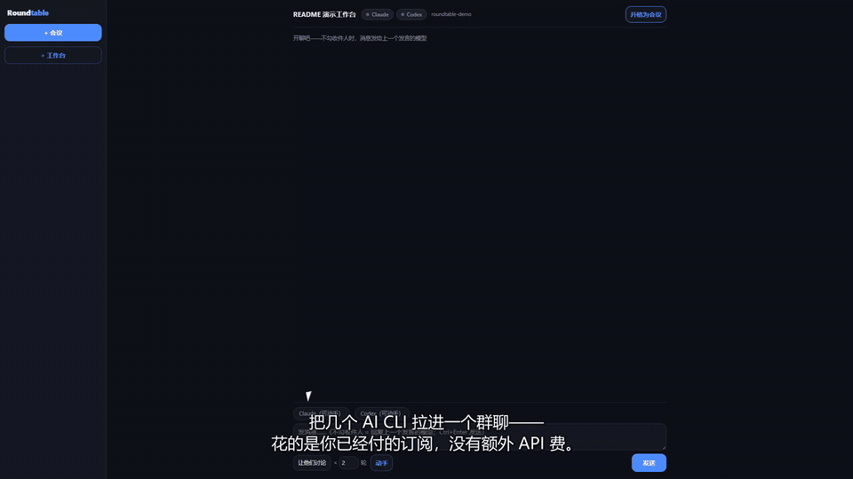

# Roundtable — One Table for All Your AI CLIs

**Group-chat your AI CLIs day to day; escalate to a structured debate committee when the decision matters.**



[▶ Watch the 64s walkthrough](docs/demo.mp4) *(Chinese narration for now; English version coming)*

> Rides your own CLI subscriptions (Claude Code / Codex / …) — zero marginal API cost, zero dependencies, all local. The UI ships in **English and 中文** (toggle in the top-left).

*[中文说明见下方](#roundtable-多引擎圆桌) · Chinese version below.*

Two rooms on one chassis:

- **Workbench** (everyday): pick models and just chat. Unaddressed messages route to whoever spoke last; address one model or broadcast to all. Hit "let them talk" and the models take turns responding to each other for N rounds — encouraged to push back and question each other by name, auto-stopping when the discussion converges. Long histories are trimmed whole-message with a visible "this model only sees the last N messages" chip — never silently. One click promotes the chat into a formal committee meeting.
- **Committee** (when it counts): when Claude Code says A and Codex says B, Roundtable runs a structured committee instead of letting you coin-flip:

```
independent takes (clean room) → cross-examination → disagreement classification → evidence-based judging → minimal next step
```

Round 1 is isolated so neither side anchors the other; later rounds attack each other's evidence; a scribe classifies every disagreement into 5 types (fact / assumption / framing / risk appetite / action); an independent judge (optionally a third engine) issues a structured verdict card. You are the moderator: pause between rounds, interject, retry, skip, or open a side-chat drawer with any participant.

Zero dependencies — Node built-ins + vanilla frontend. No `npm install` needed.

## Quick start (5 min)

**Roundtable ships no AI of its own** — it drives the AI CLIs you already have installed and logged in, spending the subscription you already pay for (no extra API cost). So step one is confirming you have at least two working CLIs.

### 1. Install and log in to at least two AI CLIs

Four engines work out of the box (install any number — **≥2 lets you hold a meeting**; other CLIs plug in below):

| Engine | Install | Verify it's installed & logged in |
|---|---|---|
| [Claude Code](https://claude.com/claude-code) | `npm i -g @anthropic-ai/claude-code`, then `claude` (guides you through login) | `claude -p "hi"` prints a reply |
| [Codex](https://github.com/openai/codex) | `npm i -g @openai/codex`, then `codex` (first-run login) | `codex exec "hi"` prints a reply |
| Gemini CLI / others | see their docs | you can chat in the terminal |

**Key point: get those verify commands working in your own terminal first.** Roundtable just runs the same commands behind the scenes — if it fails in the terminal, it'll fail in Roundtable.

### 2. Launch

Node.js ≥ 20 (`node -v`). Zero dependencies — **no `npm install`**:

```sh
git clone https://github.com/ai-us-stock-lab/roundtable
cd roundtable
npm start        # opens http://127.0.0.1:7777
```

Engines that aren't installed/logged-in are **greyed out automatically**, so a missing one never blocks the rest.

### 3. Try it

- **Just chat** → **+ Workbench** → check two models → send. No recipient checked = goes to whoever spoke last; hit **Let them talk** to relay them.
- **Let AI edit code** → mount a **git project dir** when creating the workbench → check a model marked "can build" → write the task, hit **Build** → it edits in an isolated copy and returns a diff → you Apply/Discard each file. **Nothing in your project changes until you apply.**
- **A real decision** → **+ Meeting** → topic, two debaters + judge + scribe → full debate ending in a verdict card.

### Troubleshooting

- **An engine stays greyed out**: run its verify command from step 1 in your terminal. Usually it's not logged in, or not on PATH. On Windows, if a CLI lives in a non-standard place, set that engine's `command[0]` to an absolute path in `adapters/agents.json`.
- **`npm start` says port in use**: a Roundtable is already running — just open http://127.0.0.1:7777.
- **Only reachable locally**: by design — it binds `127.0.0.1` only; your session data never leaves the machine.

Windows: double-click `open-roundtable.cmd` (health-check + start + open browser) instead of `npm start`; put a shortcut to `open-roundtable.vbs` in the Startup folder to keep it resident.

## Features

**Workbench (multi-model chat)**
- No recipient checked → replies to whoever spoke last; check one to address, several to broadcast (serial, cost-controlled).
- **Relay** — "Let them talk × N": models take turns, each sees the full labeled thread, pushes back and questions by name; stop anytime, auto-ends when talked out.
- **Build (write mode)**: mount a git repo, pick one model, hit Build — it creates/edits files in an isolated **git worktree**, posts a per-file diff card; you **Apply / Discard** each. Your working tree is untouched until you apply; applies land in the tree and are **never auto-committed** (commit stays in your own git flow). Write access is narrowed: Claude runs file-tools-only (no Bash), Codex uses native `--sandbox workspace-write`.
- **Run check** on a temp copy before applying; **session resume** so a model remembers files it already touched across builds.
- **Promote to meeting** packages the chat into a committee draft (and the verdict can flow back).

**Committee (structured debate)**
- Three-column arena with streaming, collapsible rounds/sections, round jumps, run timers.
- Rolling summary + 5-type disagreement table each round; a structured **verdict card** (adopt / key reasons / refuted claims / risks & hedges / minimal next step), one-click copy.
- Read-only workspace mount so participants cite real code by file:line.
- Session management: history, rename, reconnect-replay, cross-restart resume, archive view, soft-delete (recycle bin under `sessions/.trash/`).
- Optional one-sentence launch: install `skills/roundtable-meeting/` into your Claude Code / Codex skills dir, then say "open a multi-agent meeting" in any coding chat.

## Plug in any CLI

Engines are declared in `adapters/agents.json` — no vendor is hard-coded:

```jsonc
{
  "myai": {
    "name": "MyAI",
    "command": ["myai", "chat", "-q", "{PROMPT}"],  // argv array, never a shell string
    "input": "arg",            // stdin | file | arg (file mode uses {PROMPT_FILE})
    "output": "text",          // text | json | stream-json
    "timeoutMs": 300000,
    "envWhitelist": ["PATH", "USERPROFILE", "SYSTEMROOT"],  // subprocess sees only these
    "cwd": "workdir",
    "roles": ["debater", "judge", "summarizer"]
  }
}
```

- **Portable paths**: `command[0]` and args accept a `~/` prefix (expands to home); or use `commandEnvVar` / `commandFallbackGlob` (newest by mtime).
- `{NONCE}` expands to a unique string per call (session key for stateful CLIs); `{PROMPT}` / `{PROMPT_FILE}` are the prompt placeholders; `dropLines` drops noise lines by regex; `workspaceArgs` swaps args when a project dir is mounted.
- Validate an entry: `node scripts/smoke.js <id>`.
- **Windows**: `.cmd/.bat` shims are auto-wrapped in `cmd /c` for stdin/file input; for **arg-mode** prompts containing newlines the `.cmd` wrap is refused (cmd.exe truncation / injection surface) — point such an engine's `command[0]` at a real `.exe` or node script.

## Security

- Localhost-only; also rejects non-loopback `Host` / `Origin` (DNS-rebinding & CSRF).
- Env-var whitelisting — API keys never reach subprocesses unless whitelisted (caveat: a proxy URL with embedded credentials rides the whitelist).
- Credential redaction on everything persisted.
- Participants run read-only / tool-disabled where supported (Codex `--sandbox read-only --ephemeral`, Claude `--disallowedTools`).
- Model output is displayed as text and **never executed**; prompts always go via argv array / stdin / temp file, never a concatenated shell string.
- Write mode edits an isolated worktree; the diff lands in your working tree only after you approve, and `git apply` rejects path-traversal patches.

Every meeting is fully replayable on disk under `sessions/`: problem statement, per-round prompts and raw outputs, rolling summaries with the disagreement table, the verdict card, and a full `session.md` transcript.

License: MIT

---

# Roundtable 多引擎圆桌

**让你手里的多个 AI CLI 坐到一张桌子上——日常在工作台随手群聊，重决策升格为有规矩的委员会辩论。**

> 界面支持中英文切换（左上角切换）。

两种房间，一套底盘：

- **工作台**（高频日常）：勾选模型直接群聊，随时追问、点名任意模型接力，还能让模型之间就你的话题**互聊 N 轮**（互相反驳、追问，聊无可聊自动收敛）
- **会议**（低频重决策）：完整委员会流程，见下

Claude Code 说 A，Codex 说 B——听谁的？会议模式不让它们各说各话，而是走完整的委员会流程：

```
独立判断（clean room）→ 交叉质询 → 分歧分类 → 证据仲裁 → 最小下一步
```

- **独立判断**：第一轮双方隔离作答，互相看不见，避免先发言者带偏后发言者
- **交叉质询**：之后每轮，双方针对对方上一轮发言找漏洞、要证据
- **分歧分类**：书记角色每轮把分歧归入五类（事实 / 假设 / 框架 / 风险偏好 / 行动），各有对应处置方式
- **证据仲裁**：独立的仲裁角色（可以是第三个引擎）比较证据强弱与证伪点质量，出结构化裁决卡
- **人在环中**：你是主持人——每轮可暂停、插话、重试、跳过，也可以拉群聊直接跟参会 AI 讨论

零依赖：Node 原生模块 + 原生前端，连 `npm install` 都不用跑。

## 5 分钟上手

**Roundtable 不自带任何 AI——它调用你已经装好、已经登录的 AI CLI，花的是你已付的订阅额度，没有额外 API 费。** 所以第一步是确认你至少有两个能跑的 CLI。

### 第 1 步：装好并登录至少两个 AI CLI

默认开箱支持这四个（装几个都行，**≥2 个就能开会**；接任意其它 CLI 见下文「接入任意 CLI」）：

| 引擎 | 装 | 验证「装好且登录了」 |
|---|---|---|
| [Claude Code](https://claude.com/claude-code) | `npm i -g @anthropic-ai/claude-code` 后 `claude`（首次会引导登录） | `claude -p "说一句你好"` 能出结果 |
| [Codex](https://github.com/openai/codex) | `npm i -g @openai/codex` 后 `codex`（首次登录） | `codex exec "说一句你好"` 能出结果 |
| Gemini CLI / 其它 | 见各自文档 | 在终端里能直接对话 |

**关键：先在你自己的终端里把上面的「验证」命令跑通。** Roundtable 只是在背后调同样的命令——终端里跑不通，Roundtable 里也跑不通。

### 第 2 步：启动

需要 Node.js ≥ 20（`node -v` 检查）。零依赖，**连 `npm install` 都不用跑**：

```sh
git clone https://github.com/ai-us-stock-lab/roundtable
cd roundtable
npm start        # 浏览器打开 http://127.0.0.1:7777
```

打开页面后，没装/没登录的引擎会**自动标灰**，不影响其余引擎——所以缺哪个都不阻塞。

### 第 3 步：试一下

- **想随手聊** → 点左侧「+ 工作台」→ 勾两个模型 → 直接发消息。不勾收件人＝发给上一个发言的模型；点「让他们讨论」让模型互相接力。
- **想让 AI 改代码** → 建工作台时填一个 **git 项目目录** → 勾一个标「可动手」的模型 → 任务写进输入框点「动手」→ 它在隔离副本里改、产出 diff → 你逐个审批「应用/丢弃」。**你不点应用，你的项目一个字都不会变。**
- **要做重决策** → 点「+ 会议」→ 填议题、选两个辩手+仲裁+书记 → 走完整辩论出裁决卡。

### 常见问题

- **某个引擎一直标灰/不可用**：回终端跑第 1 步的「验证」命令。多半是没登录、或该 CLI 不在 PATH 里。Windows 上若 CLI 装在非标准位置，可在 `adapters/agents.json` 把该引擎的 `command[0]` 写成绝对路径。
- **`npm start` 报端口占用**：已有一个 Roundtable 在跑，直接开 http://127.0.0.1:7777 即可。
- **服务只能本机访问**：设计如此——只监听 `127.0.0.1`，你的会话数据不出这台电脑。

Windows 用户可双击 `open-roundtable.cmd`（自动探活+起服务+开浏览器），比 `npm start` 更省事；把 `open-roundtable.vbs` 的快捷方式放进启动文件夹即可开机常驻。

## 接入任意 CLI（适配器）

引擎在 `adapters/agents.json` 里声明，不写死任何厂商。一个条目：

```jsonc
{
  "myai": {
    "name": "MyAI",
    "command": ["myai", "chat", "-q", "{PROMPT}"],  // argv 数组，永不拼 shell 字符串
    "input": "arg",            // stdin | file | arg（file 模式用 {PROMPT_FILE} 占位）
    "output": "text",          // text | json | stream-json
    "timeoutMs": 300000,
    "envWhitelist": ["PATH", "USERPROFILE", "SYSTEMROOT"],  // 子进程只见白名单变量
    "cwd": "workdir",
    "roles": ["debater", "judge", "summarizer"]
  }
}
```

实用细节：
- **路径可移植**：`command[0]` 与参数支持 `~/` 前缀（展开为用户主目录）；也可用 `commandEnvVar` 指定环境变量、`commandFallbackGlob` 按版本目录通配取 mtime 最新
- **`{NONCE}`**：每次调用展开为唯一串，给要求"每次全新会话"的有状态 CLI 当 session key
- **`dropLines`**：按正则丢弃输出中的噪音行（如 session id）
- **`workspaceArgs`**：会话挂载了项目目录时改用的参数（如给 Claude 只开 Read/Grep/Glob 只读三件套）
- 验证：`node scripts/smoke.js <id>`
- **Windows 注意**：CLI 解析到 `.cmd/.bat` 时自动包一层 `cmd /c`，无需手工改配置（仅对 stdin/file 输入安全）；**arg 输入**的 prompt 含换行时会拒绝走 `.cmd` 包装（cmd.exe 会截断参数且构成注入面）——这类 CLI 请把 `command[0]` 配为真实 `.exe` 或 node 脚本路径

## 功能

**工作台（多模型群聊）**：
- 不勾收件人 = 自动回复上一个发言的模型（追问零操作）；勾选 = 点名/广播（串行回复控成本）
- **互聊**：「让他们讨论 × N 轮」——模型按顺序接力发言，每位都看到完整讨论（含其他模型的标注发言），被鼓励点名反驳与追问；随时可停，模型回复【无新增】自动收敛终止
- 长历史自动裁剪（整条消息取舍，绝不切半），裁剪时界面明示"该模型仅看到最近 N 条"——禁止静默截断
- **动手（写模式）**：工作台挂载 git 项目目录后，勾选一位模型点「动手」——它在 **git worktree 隔离副本**里真实创建/修改文件，产出 diff 卡片贴回聊天；你逐个审批「应用到主工作区 / 丢弃」。主工作区在你点应用之前零接触；应用只落到工作树，commit 权始终在你自己的 git 流程里。写权限收窄：Claude 只开文件工具（禁 Bash），Codex 走原生 `--sandbox workspace-write`
- **升格为会议**：一键把讨论打包成会议草稿，转入正式委员会流程（裁决可回流）
- 全程落盘（每条消息、每次调用的完整 prompt 与原始输出），跨重启恢复

**会议（委员会辩论）**：
- **三栏会场**：双辩手流式输出、轮次卡片折叠、`##` 小节折叠、轮次跳转、运行计时
- **书记摘要**：每轮滚动摘要 + 五类分歧分类表
- **裁决卡**：结构化裁决（采纳方案/关键理由/被证伪的论点/风险与对冲/最小下一步），一键复制
- **群聊抽屉**：会议轮次之外，随时基于会议上下文与任意参会 AI 自由讨论（各自立场延续）
- **工作区只读挂载**：建会话时填项目目录，参会 AI 可自行查阅真实代码、发言带文件行号引用——治"纸上谈兵"
- **会话管理**：历史列表、重命名、断线重连回放、跨重启恢复、归档只读、软删除（回收站 `sessions/.trash/`）
- **模板**：通用辩论 / 协作开发（独立设计-交叉评审-融合）/ 项目会诊；`templates/<name>/template.json` 可自定义
- **一句话发起**（可选）：把 `skills/roundtable-meeting/` 装进 Claude Code / Codex 的技能目录（`~/.claude/skills/`、`~/.codex/skills/`），在任何项目对话里说"开个多 agent 会议"，AI 自动写会诊简报、`POST /api/draft` 预填表单并弹出浏览器；会后说"导入会议结论"读回裁决卡

## 安全模型

- 服务只监听 `127.0.0.1`，并拒绝非回环 `Host` / `Origin`（防 DNS rebinding 与 CSRF）
- 子进程环境变量白名单制——API key 等敏感变量默认全部隔离（注意：代理 URL 若内嵌凭据会随白名单传递，属已知权衡）
- 所有落盘内容过凭据擦除（redaction）
- 参会 CLI 尽量以只读/禁工具模式运行（Codex `--sandbox read-only --ephemeral`、Claude `--disallowedTools`）
- 模型输出只作为文本展示，永不执行；prompt 永远走 argv 数组 / stdin / 临时文件，不拼 shell 字符串
- 写模式改的是隔离副本，diff 经你审批才落到工作树；`git apply` 拒绝路径穿越 patch

## 会话产物（可复盘）

每场会议落盘 `sessions/<日期-议题>/`：`problem.md`、各轮 prompt 与原始输出、`summaries/`（滚动摘要+分歧表）、`judge-card.md`、`session.md`（全程回放）、`chat.jsonl`（群聊）、`outcome.md`（会后采纳追踪，手填）。删除为软删除（移入 `sessions/.trash/`，可手工找回）。

---

## 路线备忘（维护者）

写模式（AI 改文件的 diff-only 桥接）已上线（工作台「动手」）。其它待触发的债：委员会/工作台抽公共内核（出现第三形态时）、上下文滚动摘要（截断变频繁时）。数据来源为各场 `sessions/<dir>/outcome.md`。
